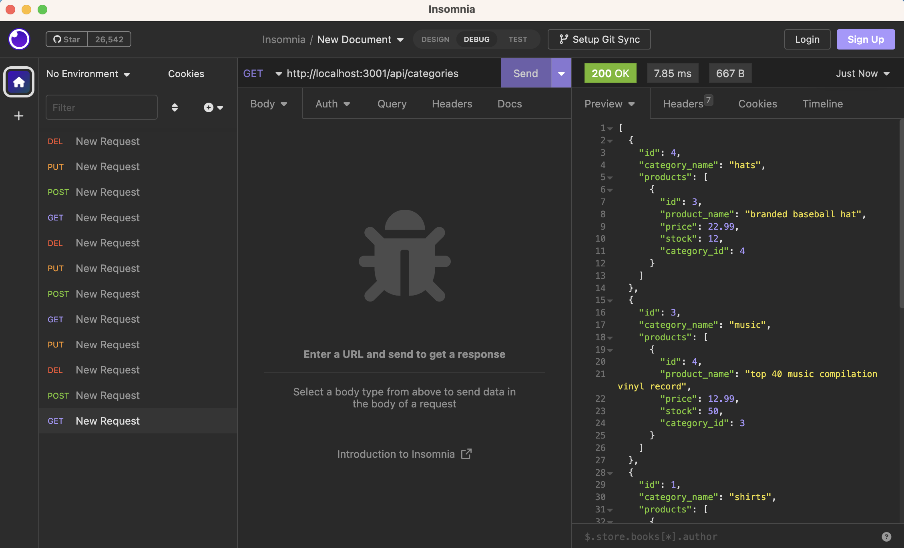
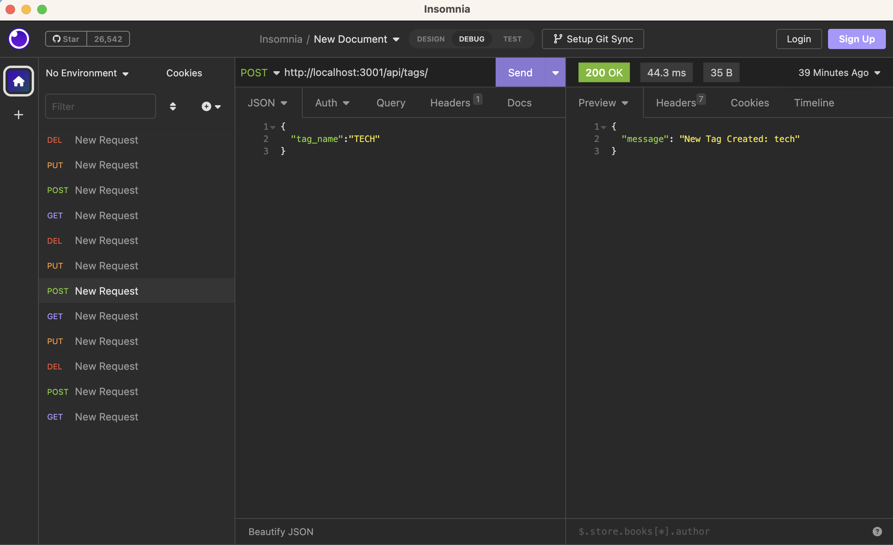
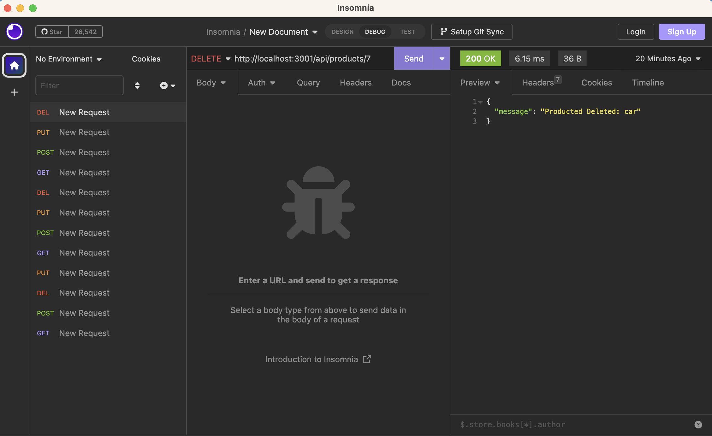

# E-COMMERCE BACKEND 

  ## <a id="Description">Description</a> 

  This is the backend API of an e-commerce site that allows the owner to perform CRUD operations on the website's inventory. It is run with the help of the express, sequelize, mysql2, and dotenv packages.

  To begin using the API, hop into the mysql shell on the command line and execute schema.sql so the database is established. Also remember to type in your mysql credentials into the .env file with matching info so later you can fire up the server to connect to the database through sequelize.

  After you're successfully established the database, seed the database by running the command "node seeds.js" within the seeds directory, and your database will be seeded with test data for you to test CRUD operations with the backend API on Insomnia. 

  Finally, run "node server.js" to turn on the server and establish connection with the database. 
  You can now turn to Insomnia and perform CRUD operations on the seeded test data.

  On Insomnia, you can perform GET,POST,PUT,and DELETE requests to the API.

  For GET requests, you're able to retrieve: all the category data with associated product info, all the product data with associated tag info, and tag data with associated category and product info. You can also retrieve data on a single category, product, or tag data by passing an id as a request parameter.
  
  For POST requests, you're able to: create a new category, a new product (with product category and product tag info), and a new tag. 

  For PUT requests, you're able to: update info on a category, a product, or a tag.

  For DELETE requests, you're able to delete a category, a product, or a tag by passing in an id in the request parameter.

  If any any point, an id is passed in a request and that id is not found in the database, the user will be alerted accordingly. If there is no data left in the database for categories, products, or tags, the user will alerted accoringly. If the data the user is trying to create already exists in the database, the user will be alerted accordingly. 

  Click <a href="" target="_blank">HERE</a> for the video that demonstrates the functionality of this App. 
  (URL: )

  The URL of the Github repo is: https://github.com/FeddericoWayne/ECommerce-Backend

  
  GET request screenshot:
  

  POST reqeust screenshot:
  

  PUT reqeust screenshot:
  

  DELETE reqeust screenshot:
  

***

  ## Table of Content

  ### [Description](#Description)
  ### [Installation](#Installation)
  ### [Usage](#Usage)
  ### [License](#License)
  ### [Contributing](#Contributing)
  ### [Tests](#Tests)
  ### [Questions](#Questions)

***

  ## <a id="Installation">Installation</a>

  No installation is needed. Follow the instructions in the Description section of this README to initiate this backend API.

***

  ## <a id="Usage">Usage</a>

  Use this app to record and track info on all the employees of your company, as well as inquiring the total utilized budget of each department.

***

  ## <a id="License">License</a>
  
  This App is covered under the MIT license.

  
***

  ## <a id="Contributing">Contributing</a>

  Please refer to the Question section of this README for my contact information if you'd like to contribute to this project!

***

  ## <a id="Tests">Tests</a>

  N/A
  

***

  ## <a id="Questions">Questions</a>

  For more info on my work, please check out my GitHub page at: https://github.com/feddericowayne
  
  Should you have any further questions regarding this App, please don't hesitate to reach out to me via email at: <a href="mailto:jackiew1120@hotmail.com">jackiew1120@hotmail.com</a>

  